# wikimap

[](https://github.com/dhha22/wikimap/actions/workflows/ci.yml) [](https://pypi.org/project/wikimap/) [](https://pypi.org/project/wikimap/) [](LICENSE)

[English](README.md) | 한국어

**지식 vault를 위한 zero-LLM 증분 인덱스 + 지연 시맨틱 레이어 — 마크다운, HTML, PDF, 이미지.**

파이썬 파일 하나. 의존성 0. 빌드 시점 LLM 비용 0 — 언제나. 인덱스가 아무리 오래 방치돼도 업데이트는 1초 미만.

지식 vault(Obsidian vault, 팀 위키, 스펙·슬라이드·계획 문서 폴더)를 다루는 AI 코딩 어시스턴트(Claude Code 등)를 위해 만들어졌습니다.

## 왜 지식 그래프 도구나 RAG가 아닌가?

지식 그래프 도구([graphify](https://github.com/Graphify-Labs/graphify) 같은)나 RAG는 **미리** 생각을 다 해둡니다: 코퍼스 전체를 LLM에 통과시켜 그래프나 벡터 스토어를 만들죠. 잘 작동합니다 — 다만 **업데이트할 때마다 그 값을 다시 치릅니다.** 문서 하나 고치면 재추출 비용이 나가고, vault를 일주일 방치하면 "증분" 업데이트가 조용히 절반을 다시 처리합니다.

wikimap은 이걸 뒤집습니다: **구조는 지금 파싱하고, 의미는 나중에 배운다.**

- **구조는 공짜입니다** — 제목, 헤딩, 링크, 요구사항 ID. 그냥 파싱이라 LLM도, API 키도, 관리할 임베딩도 없습니다.
- **의미는 물어볼 때 적립됩니다.** 에이전트가 답을 알아내면 그 답을 저장하고, 두 문서가 관련 있다고 확인하면 그 링크를 저장합니다. 혹시 쓸까 봐 미리 계산해두는 건 하나도 없습니다.

이걸 안전하게 만드는 장치: **저장되는 모든 것에 원본 파일의 콘텐츠 해시가 찍힙니다.** 파일을 고치면 낡은 답은 알아서 사라집니다 — 에이전트에게 철 지난 사실을 조용히 먹이는 대신에요.

그래서 LLM 비용은 **실제로 물어본 만큼**만 나가고, vault 크기와는 무관합니다.

## graphify 대비 실측 (262문서 한/영 vault, M 시리즈 Mac)

<sub>wikimap 열은 **0.15.0 실측**입니다(270문서 링크 제거 한/영 코퍼스, M 시리즈 Mac, 각 항목 3–5회 median). graphify 열은 원본 262문서 vault에서 graphify를 실제로 돌린 값입니다 — 문서 수가 조금 다르지만 규모는 동급이며, 절대 수치가 아니라 자릿수 차이가 요점입니다.</sub>

| 작업 | wikimap 0.15.0 | graphify (동일 규모 vault, 동일 변경) |
|---|---|---|
| 전체 인덱스 빌드 | **0.28초, $0** (인덱싱 0.22초) | 수 분 + LLM 추출 비용 |
| 문서 1개 수정 + 1개 추가 + 1개 삭제 후 업데이트 | **0.07초, 0 토큰** | **~95초 + 46k 토큰** (실측), 커뮤니티 재라벨링 별도 |
| 며칠 방치된 인덱스 업데이트 | 여전히 1초 미만 (sha-diff, no-op 0.07초) | 306개 중 287개를 변경으로 재감지 → 사실상 전체 재추출 |
| 링크 후보 생성 (270문서 전수) | **0.32초, 0 토큰** (7,438쌍) | 그래프 빌드 314초 + 241만 토큰 |
| 검색 지연 (자연어 질의) | **0.15초** 단일, **0.26초** 3표현 fan-out (콜드 프로세스, 인덱스 로드 포함) | 1ms 인메모리 — 단, **11분·220만 토큰짜리 그래프 빌드 이후** |
| 검색 출력 | 섹션 + 라인 번호 + 매치 스니펫 | 엔티티 라벨 — 결국 원본 파일을 다시 읽어야 함 |
| 삭제 파일 정리 | 자동, 검증됨 | 그래프 소스 파일의 9.7%가 고스트(이미 삭제됨); 중복 노드 라벨 40개 |
| 결정성 | 같은 입력 → 바이트 단위 동일 인덱스 | 동일 입력에서 비결정적 그래프 ([업스트림 #1695](https://github.com/Graphify-Labs/graphify/issues/1695)) |

<sub>검색 지연은 graphify가 raw 수치로 이기는 유일한 항목이고, 단서가 필요합니다: graphify의 1ms는 **수 분과 수백만 토큰을 들여 만든 그래프를 미리 메모리에 올려둔 뒤**의 조회이고, wikimap의 0.15초는 **매 호출마다 프로세스를 새로 띄우고 인덱스를 로드하는** 값입니다. 총소유비용은 비교가 되지 않습니다.</sub>

대규모에서(같은 vault를 **3,760문서**로 복제): 전체 빌드 12초(1회성 — 500문서 이상에서 FTS5 trigram 인덱스 가동), 변경 3건 증분 업데이트 **0.19초**, 검색 60–100ms(FTS5, 선형 폴백은 ~0.3초). 3자 미만 term이 포함된 질의는 정확한 선형 스캔으로 폴백하므로, 속도를 위해 CJK 짧은 단어 recall을 희생하지 않습니다.

짚어둘 결과 두 가지:

- **골든셋** (30문항, 한/영/혼합, 358문서 vault): **recall@5 30/30** — 그리고 0.5.0 이후 모든 기능 릴리스에서 계속 30/30입니다. 랭킹 변경은 CI에서 이 셋으로 게이트되므로, **정확도를 조용히 깎아먹는 "속도 개선"은 통과할 수 없습니다.**
- **블라인드 테스트** (신규 질문 20개, 어떤 도구인지 모르는 에이전트가 작성·판정): wikimap **14/20** vs graphify **11/20**, 유용성 투표는 **16:3:1** 승 — 심판 3명이 20문항 전부 만장일치.

테스트는 104건, stdlib만 씁니다(`python3 tests.py`). macOS·Linux·Windows, Python 3.8~3.13에서 CI가 돌아갑니다.

### 자연어 검색 vs graphify — v5 블라인드 벤치마크 (wikimap 0.15.0)

이전 골든셋은 문서 제목을 되풀이하는 경향이 있었습니다. **v5**는 정반대입니다: 문서 *본문*(결정·수치·엣지케이스)을 겨냥한 구어체 질문 71개를, 제목을 보지 않고 본문을 읽은 문서별 에이전트가 작성했습니다. 정답셋은 v3·v4 세트와 **문서가 하나도 겹치지 않으므로**, 여기서의 향상은 과적합이 아닌 실제 검색력입니다. 두 도구 모두 같은 270문서 코퍼스에서 실행 — graphify는 v1 그래프(빌드 314초·241만 토큰)를 재사용하고, wikimap은 0.23초·$0에 인덱싱합니다.

```mermaid
xychart-beta
    title "v5 natural-language search — recall / MRR (71 queries, higher is better)"
    x-axis ["recall@1", "recall@3", "recall@5", "recall@10", "MRR"]
    y-axis "score" 0 --> 1
    bar [0.507, 0.761, 0.789, 0.803, 0.627]
    bar [0.493, 0.746, 0.873, 0.944, 0.647]
    line [0.183, 0.394, 0.563, 0.690, 0.338]
```



<sub>막대 = wikimap 0.15.0, **단일 질의** · **3표현 fan-out** (원 질문 + 에이전트 재작성 2개, 한 번의 호출) · 선 = graphify (v1 그래프, BFS) — 정확한 수치는 아래 표</sub>

| 지표 | wikimap — 단일 질의 | wikimap — fan-out | graphify |
|---|---|---|---|
| recall@1 | **0.507** | 0.493 | 0.183 |
| recall@3 | **0.761** | 0.746 | 0.394 |
| recall@5 | 0.789 | **0.873** | 0.563 |
| recall@10 | 0.803 | **0.944** | 0.690 |
| MRR | 0.627 | **0.647** | 0.338 |
| top-40 미스 | 14건 | **0건** | — |
| 링크 생성(270문서) | **0.59초, 0 토큰** | — | 314초, 241만 토큰 |

<sub>두 wikimap 열은 **버전이 아니라 질의 모드**입니다 — 둘 다 0.15.0에서 재측정했고, 0.13.0/0.14.0 수치를 소수점 셋째 자리까지 그대로 재현했습니다(0.15.0은 설계상 랭킹을 바꾸지 않습니다).</sub>

**LLM 없이 어떻게 이기나:** 작업이 빌드 시점이 아니라 **질의 시점**에 일어납니다. 기능어는 코퍼스에서 얼마나 흔한지로 자동 탈락하고(하드코딩 스톱리스트가 없으니 어떤 언어에서도 작동합니다), 여러 섹션에 흩어진 매칭은 문서 단위로 합산되며, 어미는 일반적으로 처리됩니다 — `core:ui로`도 `core`·`ui`를 찾아냅니다. 전부 결정적이고, 전부 $0입니다.

**fan-out은 직접 켜줘야 하는 유일한 기능입니다.** 질문에 재작성 1~2개를 더해 한 번에 넘기세요:

```bash
wikimap search "세션 얼마나 유지돼?" "세션 만료" "REQ-02 타임아웃"
```

랭킹이 융합되어, **여러 표현이 공통으로 지목한 문서**가 위로 올라옵니다. 원 질문은 항상 투표에 남으므로 재작성은 더하기만 할 뿐입니다 — 그래서 격차가 메워졌습니다: **하드 미스 14건 → 0건.** 재작성은 에이전트가 씁니다(이미 대화 중이니 추가 API 호출 0), 3개 표현의 비용은 1개보다 **~0.1초** 더 들 뿐입니다.

트레이드오프는 정직하게: recall@1/@3은 살짝 떨어집니다. 여러 랭킹을 섞으면 최상위 한 방이 희석되니까요. **놓치기 싫으면 fan-out, 1등을 뾰족하게 원하면 단일 질의**입니다.

### 0.15.0 — 결과는 그대로, 기다림은 절반

fan-out은 검색을 좋게 만든 대신 느리게 만들었습니다 — 3개 표현은 곧 3회 전수 스캔이니까요. 0.15.0은 이걸 **재채점이 아니라 캐싱으로** 해결합니다. 그래서 두 배 빠르면서 **결과는 완전히 동일**합니다.

| | 0.14.0 | 0.15.0 | 결과 변화 |
|---|---|---|---|
| 단일 질의 | 0.30초 | **0.15초** | **없음** |
| 3표현 fan-out | 0.66초 | **0.26초** | **없음** |

마지막 열이 핵심이고, 주장이 아니라 **검증된 사실**입니다: 148개 랭킹이 0.14.0과 소수점까지 동일합니다. **결과를 조용히 뒤섞는 속도 개선은 개선이 아니라 버그입니다.**

내 vault에서 재현: `python3 bench.py --root <vault> --cold`, 또는 자체 골든셋으로: `bench.py --root <vault> --queries q.tsv` (`질의<TAB>기대-경로-부분문자열` 형식).

## 설치

```bash
pipx install wikimap                # 또는: uv tool install wikimap / pip install wikimap
cd your-vault && wikimap update
```

또는 파일 하나만 복사 — 같은 결과, 오프라인·pip 없는 환경에서도 동작:

```bash
curl -O https://raw.githubusercontent.com/dhha22/wikimap/main/wikimap.py
cd your-vault && python3 wikimap.py update
```

어느 쪽이든 `wikimap install`(또는 `python3 wikimap.py install`)이 AI 에이전트들에 등록해 줍니다 — 아래 참조. Python 3.8+ 외에는 아무것도 필요 없습니다.

## 어떤 AI 에이전트와도 사용

wikimap은 특정 어시스턴트에 종속되지 않습니다. 코어는 평범한 CLI(모든 질의 명령에 `--json`)이고, 등록은 오픈 표준을 따릅니다:

- **Claude Code, Codex, GitHub Copilot 등 [agent-skills](https://agentskills.io) 지원 도구** — `wikimap install`이 스킬(`SKILL.md` + 도구 본체)을 `~/.claude/skills/wikimap/`(Claude Code)과 `~/.agents/skills/wikimap/`(Codex 등이 스캔하는 오픈 표준 경로) 두 곳에 복사합니다. 에이전트가 자동 발견해서 vault 질문에 wikimap을 꺼내 씁니다. 한 곳만 원하면 `--target claude|agents`.
- **repo 단위 팀 공유** — `wikimap install --project`는 `./.claude` + `./.agents`에 설치. 커밋하면 팀원 전원의 에이전트가 같은 설정을 받습니다.
- **Cursor 등 `AGENTS.md`를 읽는 도구** — `wikimap install --agents-md`가 `./AGENTS.md`에 마커로 구분된 사용 규칙 블록을 삽입합니다 (멱등: 재실행하면 블록만 갱신되고 나머지 내용은 절대 건드리지 않음).
- **그 외 전부** — 셸 명령을 실행할 수 있는 에이전트라면 `wikimap search/links/path/suggest ... --json`을 직접 쓰면 됩니다. 스킬 파일은 사용 설명서일 뿐 런타임 의존성이 아닙니다.

**스킬은 두 개가 설치되고**, 에이전트가 알아서 골라 씁니다:

| 스킬 | 에이전트가 꺼내 쓰는 상황 |
|---|---|
| `wikimap` | vault에 대해 질문하거나, vault를 수정해서 재인덱싱이 필요할 때 |
| `graphify-to-wikimap` | `graphify-out/` 디렉터리를 발견했고 graphify를 걷어내려 할 때 — `wikimap migrate`를 실행한 뒤, 명령어가 손댈 수 없는 운영 규칙과 git 설정까지 정리합니다 |

마음껏 커스터마이즈하세요: 설치된 `SKILL.md`에 vault 경로·언어·자기 규칙을 적어도 — 업그레이드는 기존 `SKILL.md`를 절대 덮어쓰지 않고 도구 본체만 갱신합니다. **두 스킬 다** 그렇게 보존되고, 테스트로 게이트되어 있습니다.

## 실제 모습

```console
$ wikimap update
wikimap: 304 files indexed (2 changed, 0 deleted) in 147ms | skipped 2 non-indexed files (.tsv 2) | notes: 3 fresh, 0 stale | edges: 112 fresh, 2 stale | MAP.md updated

$ wikimap search "세션 만료 정책"
[NOTE fresh 2026-07-02] Q: 세션은 얼마나 유지되나?
  30분 슬라이딩 만료; 리프레시 토큰은 14일 (REQ-02)
  sources: specs/auth-spec.md
specs/auth-spec.md:12  [로그인 정책]  (score 27)
  REQ-01 세션 만료는 30분. [[auth-plan]] 참고.
```

모든 결과는 파일 + 라인 번호 + 매치된 라인입니다 — 에이전트가 파일 전체를 다시 읽는 대신 정확한 섹션으로 바로 점프합니다. 맨 위의 `[NOTE fresh]`는 이전에 저장된 답변으로, 원본 해시가 여전히 일치할 때만 표시됩니다.

## 명령어

실제로 치게 될 두 개:

| 명령어 | 하는 일 |
|---|---|
| `update` | 바뀐 것만 재인덱스하고 `MAP.md` 갱신. 1초 미만, $0. 수정 후 실행하거나 git 훅에 맡기세요 |
| `search "질의" ["재작성" ...]` | 질문에 답하는 섹션 찾기. 파일·라인 번호·매치된 줄을 돌려줍니다. 표현을 더 넘기면 하나의 랭킹으로 융합 |

나머지는 용도별로:

| | 명령어 | 하는 일 |
|---|---|---|
| **연결 따라가기** | `links <문서>` | 이 문서가 뭘 가리키고 뭐가 이걸 가리키는지 — `REQ-nn` ID를 언급하는 문서까지. 각 항목이 **사람이 쓴 링크인지 에이전트가 추론한 건지** 표시됩니다 |
| | `path <a> <b>` | 두 문서를 잇는 최단 링크 사슬 |
| **연결 늘리기** | `suggest` | *있어야 할* 링크를 공짜 신호(공유 희귀어, 같은 요구사항 ID, 폴더 근접성)로 제안. 1초 미만, LLM 없음 |
| | `link add <문서> <대상>` | 확정된 링크를 문서 본문에 기록. `--apply` 없으면 dry run |
| **답변 기억하기** | `note add` | 에이전트가 알아낸 답을 출처에 고정해 저장 |
| | `edge add` / `edge repin` | 두 문서의 연결 확정 / 수정 후 재고정 |
| | `notes` / `edges` | 캐시된 것 목록 — stale은 알아서 숨습니다 |
| **시맨틱 검색** | `embed set` / `semsearch` | 문서와 **단어가 하나도 안 겹치는** 질문용. 벡터는 에이전트가 만들고(어떤 모델이든), wikimap은 저장·랭킹만 |
| **관리** | `mv <old> <new>` | 문서 개명 + 그걸 가리키는 모든 링크 재작성 |
| | `fix-links` | 깨진 링크의 대상 후보 제안 (자동 적용 안 함) |
| | `install` | 에이전트 스킬로 등록, `--hook`이면 커밋마다 자동 `update` |
| | `migrate` | graphify vault를 한 명령어로 이관 (아래 참고). `--apply` 없으면 dry run |

캐시되는 것(노트·엣지·임베딩)은 전부 **원본 파일의 콘텐츠 해시에 고정**됩니다. 그 파일을 고치면 캐시된 지식은 알아서 stale이 되어 빠집니다 — 에이전트에게 낡은 사실을 먹이는 대신에요.

모든 질의 명령어는 `--json`을 받습니다. 전체 플래그(구절·필드·유형 필터, 컨텍스트 줄, ignore 규칙 등)는 `wikimap <명령어> --help`로 보세요.

### graphify에서 넘어오시나요?

```bash
wikimap migrate            # 뭘 할지 정확히 보여줍니다
wikimap migrate --apply    # 실행합니다
```

한 명령어로 끝납니다: graphify가 추론한 연결을 가져오고, graphify 아티팩트(`graphify-out/`, `.graphifyignore`)를 지우고, 재인덱싱합니다. **문서는 절대 건드리지 않습니다** — 당신이 쓴 `graphify-회고.md` 같은 파일은 아티팩트가 아니라 콘텐츠이므로 그대로 남습니다.

**순서가 중요한데, 이 명령어가 그걸 지킵니다: `graph.json`을 지우기 전에 엣지를 먼저 가져옵니다.** 손으로 하다 순서를 뒤집으면 그 연결은 영영 사라집니다. 가져온 엣지는 오히려 **들어올 때보다 좋아집니다** — 양쪽 문서의 콘텐츠 해시에 고정되어, 문서가 바뀌면 알아서 stale이 됩니다. graphify의 그래프엔 없던 보장이죠.

깨끗하게 새로 시작하고 싶다면 `--apply --no-import`로 기존 엣지를 버리세요. `suggest`가 결정적으로, 공짜로 후보를 다시 만들어 줍니다.

아니면 에이전트에게 **"이 vault를 graphify에서 떼어내줘"**라고만 하세요 — `wikimap install`이 `graphify-to-wikimap` 스킬을 함께 깔아둡니다. 이 스킬이 명령어를 대신 실행하고, 명령어가 못 하는 부분까지 처리합니다: `CLAUDE.md`·`AGENTS.md` 규칙을 wikimap으로 돌리고, git에서 아티팩트를 추적 해제하는 일까지요.

## LLM 없이 연결을 찾아내는 방식

1. **`suggest`가 공짜로 후보를 제안합니다.** 희귀한 용어를 공유하거나, 같은 요구사항 ID를 인용하거나, 그냥 같은 폴더에 있는 두 문서는 관련 있을 가능성이 큽니다. **당신이 이미 만들어 둔 폴더 구조가 곧 공짜 시맨틱**이고, 이걸 알아채는 데 LLM은 필요 없습니다.
2. **에이전트는 후보만 판별하고**, 진짜만 `link add`로 문서에 씁니다. 코퍼스 전체가 아니라 짧은 후보 목록만 읽으므로 **비용은 vault 크기가 아니라 수정량에 비례**합니다.
3. **확정된 링크는 알아서 stale이 됩니다** — 어느 한쪽이 바뀌면요. 수정 후에도 여전히 유효하다면 `edge repin`으로 rationale을 다시 타이핑하지 않고 유지합니다.

**링크가 하나도 없는 폴더에서 시작한다면?** `suggest -n 0 --json`으로 후보를 뽑고, 에이전트에게 판별시키고, 진짜만 `link add`로 적용하세요.

이건 어렵게 검증했습니다: 348문서 vault에서 **사람이 쓴 위키링크 949개를 전부 제거하고** 복원을 시도했습니다. 후보 전수 조사는 1초도 안 걸리고, **원래 링크의 85%를 되찾습니다** — 그동안 LLM은 후보 쌍만 볼 뿐 코퍼스는 건드리지 않습니다.

## 산출물

- `MAP.md` — vault 루트. 디렉터리 분류, 허브 문서, 최근 변경, 문서 횡단 요구사항 ID, 추론 연결, fresh 노트. 에이전트의 진입점.
- `.wikimap/semantics.jsonl` — 노트와 엣지 본체, append-only JSON lines. **이 파일이 시맨틱 레이어의 원본(source of truth)** 입니다: git에 커밋해 어시스턴트가 vault에 대해 학습한 것을 백업·공유하세요. 손으로 편집 가능하며, 잘못된 한 줄이 레이어 전체를 무너뜨리지 않습니다.
- `.wikimap/index.db` — SQLite. 파생 캐시라 정말로 지워도 됩니다: 언제든 삭제하면 `update`가 파일들 + `semantics.jsonl`에서 손실 없이 재구축합니다.

≤0.5.x에서 업그레이드: 첫 실행이 기존 DB의 노트/엣지를 `semantics.jsonl`로 자동 이관합니다. 1회성, 할 일 없음.

## 다른 vault 도구와의 공존

wikimap은 독립 라이브러리입니다 — 폴더를 관리하는 다른 무언가를 전제하지 않습니다. 다른 앱(Obsidian, 자체 인덱스를 가진 세컨드 브레인 앱, 정적 사이트 생성기)이 같은 루트를 지켜보고 있다면, 세 가지 손잡이로 서로 밟지 않게 합니다:

- **`.wikimapignore`** — vault 루트에 한 줄당 디렉터리명/글롭 하나. 다른 도구의 산출물(휴지통, 빌드 출력)을 wikimap 인덱스 밖에 둡니다. `.trash/`, `.obsidian/`, 흔한 빌드 디렉터리는 기본 제외.
- **`--map-path .wikimap/MAP.md`** — 다른 도구가 루트의 마크다운을 인덱싱한다면, 루트에 생성된 `MAP.md`는 거대 허브 노드로 그 그래프를 오염시킵니다. `.wikimap/` 안으로 옮기면(다른 도구는 어차피 스킵해야 할 곳) 에이전트 외에는 보이지 않습니다. 아예 생성을 끄려면 `--no-map`. 둘 다 실행 간 영속.
- **`suggest --wikilink`** — 발견한 연결을 확정할 때는 `edge add`보다 문서 본문에 명시적 `[[링크]]`를 붙여넣는 쪽을 우선하세요. 파일이 원본이고, 명시적 링크는 모든 vault 도구가 이해하는 유일한 연결 형식입니다.

## 범위

wikimap의 목표는 **폴더 안 모든 문서가 — 포맷이 무엇이든 — 찾아지는 것**, 그리고 그 위의 관계 레이어입니다. 현재 인덱싱:

- **마크다운** — 핵심: frontmatter(`title`, `tags`), 헤딩, 위키링크, md 링크.
- **플레인 텍스트 산문** (`.txt`, `.rst`, `.org`, `.adoc`) — 문단 블록 단위 섹션화.
- **HTML** (`.html`, `.htm`) — 태그 스트립, `<title>`/`<h1>`을 제목으로, 헤딩 태그 단위 섹션화; 로컬 문서로 향하는 `<a href>` 앵커는 링크 그래프에 편입, `<script>`/`<style>` 제외.
- **PDF** — 표준 라이브러리만으로 텍스트 추출, 의존성 0. 까다로운 케이스(CJK·서브셋 임베딩 폰트)도 처리하고, 각 페이지를 하나의 검색 섹션으로 다룹니다. 스캔 이미지 PDF는 OCR 없이는 누구도 못 읽으므로, wikimap은 이름 기준 인덱싱으로 폴백하고 **update 출력에 그 사실을 명시합니다** — 된 척하지 않습니다.
- **이미지** (`.png`, `.jpg`, `.jpeg`, `.gif`, `.webp`) — 내용 분석 없음; 파일명과 그 이미지를 참조하는 모든 **alt 텍스트**(``, ``)로 인덱싱하고, 이미지 참조는 링크 그래프에 편입됩니다. "그 결제 플로우 다이어그램 어디 있지?"가 이름 또는 alt로 풀립니다. `.svg`는 추가로 `<title>`/`<desc>`/텍스트 노드를 기여합니다.

코드 AST는 파싱하지 않습니다 — 코드베이스의 호출 그래프가 필요하면 코드 전용 도구를 쓰세요. wikimap은 구조를 가진 산문 코퍼스에서 빛납니다: 스펙, 정책, 계획, 노트, 리서치.

## 라이선스

MIT
