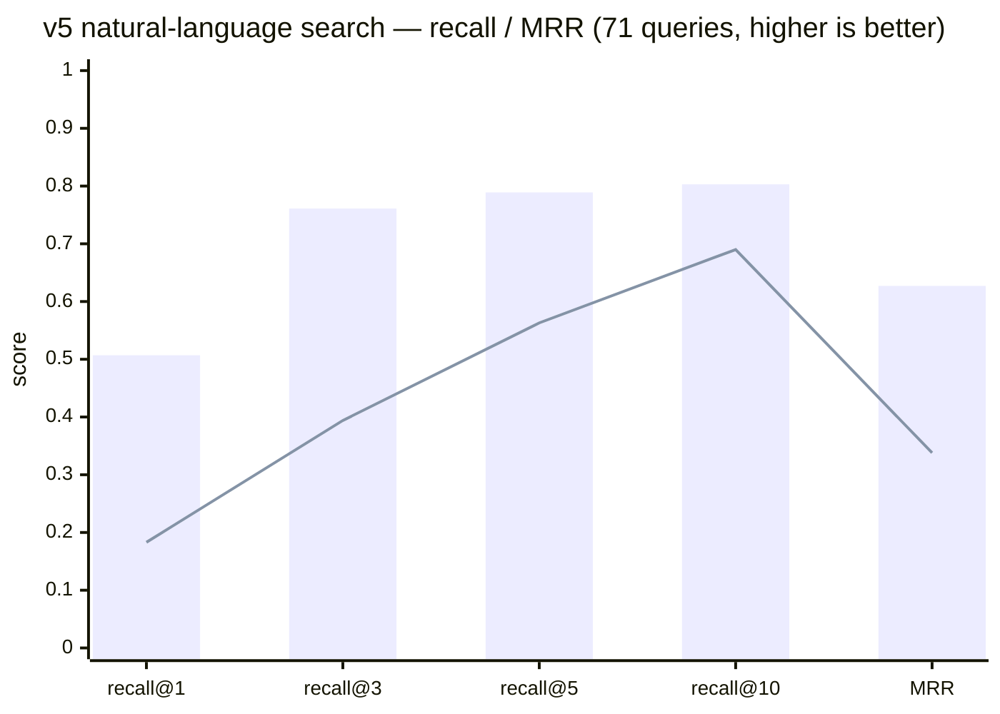

# wikimap

[](https://github.com/dhha22/wikimap/actions/workflows/ci.yml) [](https://pypi.org/project/wikimap/) [](https://pypi.org/project/wikimap/) [](LICENSE)

[English](README.md) | 한국어

**지식 vault를 위한 zero-LLM 증분 인덱스 + 지연 시맨틱 레이어 — 마크다운, HTML, PDF, 이미지.**

파이썬 파일 하나. 의존성 0. 빌드 시점 LLM 비용 0 — 언제나. 인덱스가 아무리 오래 방치돼도 업데이트는 1초 미만.

지식 vault(Obsidian vault, 팀 위키, 스펙·슬라이드·계획 문서 폴더)를 다루는 AI 코딩 어시스턴트(Claude Code 등)를 위해 만들어졌습니다.

## 왜 지식 그래프 도구나 RAG가 아닌가?

[graphify](https://github.com/Graphify-Labs/graphify) 같은 도구는 **빌드 시점에** LLM으로 엔티티·관계를 추출합니다(eager 추출). 추론된 연결을 얻는 대가로 매 업데이트마다 비용을 치릅니다: 문서 하나를 고치면 재추출 비용이 나가고, 인덱스를 일주일 방치하면 "증분" 업데이트가 코퍼스 절반을 다시 추출합니다. RAG도 같은 eager 문제를 갖습니다 — 코퍼스 전체를 미리 임베딩하고 돌봐야 할 벡터 스토어를 안깁니다.

wikimap은 설계를 뒤집습니다: **구조는 eager하게, 시맨틱은 lazy하게.**

- **구조는 공짜입니다.** 제목, 헤딩, 위키링크, 마크다운 링크, 요구사항 ID, 코드 파일 참조 — 전부 결정적 파싱으로 추출합니다. LLM 없음, 임베딩 없음, API 키 없음.
- **시맨틱은 답변 시점에 적립됩니다.** 어시스턴트가 문서들을 종합해 질문에 답하면, 그 결론을 원본 파일들의 콘텐츠 해시에 고정된 *노트*로 저장합니다. 문서 사이의 안 적힌 연결을 확인하면 양쪽 해시에 고정된 *엣지*가 됩니다. 그리고 키워드 검색으로 자연어 질문을 못 잡을 때는 어시스턴트가 필요한 문서만 그때그때 임베딩합니다 — wikimap은 벡터를 저장·코사인 랭킹만 하고 **생성은 에이전트**(어떤 모델이든)가 하므로, 빌드 타임 LLM도 내장 의존성도 여전히 없습니다. 이 전부가 콘텐츠 해시에 고정됩니다: 원본이 바뀌면 캐시된 지식은 자동으로 stale이 되어, 낡은 사실을 모델에 먹이는 대신 조용히 빠집니다.

LLM 비용은 **실제로 물어본 것**에 비례하고, 코퍼스 크기에는 절대 비례하지 않습니다.

## graphify 대비 실측 (262문서 한/영 vault, M 시리즈 Mac)

<sub>아래 빌드/업데이트/결정성 수치는 wikimap 0.4.0 기준입니다. 검색 품질은 이후 크게 개선됐습니다 — 아래 v5 벤치마크 참고.</sub>

| 작업 | wikimap | graphify (동일 vault, 동일 변경) |
|---|---|---|
| 전체 인덱스 빌드 | 0.5초, $0 | 수 분 + LLM 추출 비용 |
| 문서 1개 수정 + 1개 추가 + 1개 삭제 후 업데이트 | **0.1초, 0 토큰** | **~95초 + 46k 토큰** (실측), 커뮤니티 재라벨링 별도 |
| 며칠 방치된 인덱스 업데이트 | 여전히 1초 미만 (sha-diff) | 306개 중 287개를 변경으로 재감지 → 사실상 전체 재추출 |
| 검색 recall@5 (한/영 혼합 10문항) | **10/10**, ~60ms | 시작 노드 매칭 5/10 — 기본 질의 필터가 4자 미만 term을 버려 짧은 한국어 term 전멸 |
| 검색 출력 | 섹션 + 라인 번호 + 매치 스니펫 | 엔티티 라벨 — 결국 원본 파일을 다시 읽어야 함 |
| 삭제 파일 정리 | 자동, 검증됨 | 그래프 소스 파일의 9.7%가 고스트(이미 삭제됨); 중복 노드 라벨 40개 |
| 결정성 | 같은 입력 → 바이트 단위 동일 인덱스 | 동일 입력에서 비결정적 그래프 ([업스트림 #1695](https://github.com/Graphify-Labs/graphify/issues/1695)) |

대규모에서(같은 vault를 **3,760문서**로 복제): 전체 빌드 12초(1회성 — 500문서 이상에서 FTS5 trigram 인덱스 가동), 변경 3건 증분 업데이트 **0.19초**, 검색 60–100ms(FTS5, 선형 폴백은 ~0.3초). 3자 미만 term이 포함된 질의는 정확한 선형 스캔으로 폴백하므로, 속도를 위해 CJK 짧은 단어 recall을 희생하지 않습니다.

확장 골든셋 30문항(한/영/혼합, 309문서 vault): **recall@5 30/30, 평균 67ms** (0.5.0 HTML 인덱싱, 0.6.0 시맨틱 파일 마이그레이션, 0.7.0 PDF/이미지 인덱싱, 0.8.0 CMap 디코딩+부분 일치 폴백, 0.9.0 별칭 인덱싱, 0.10.0 suggest 근접성 랭킹 이후 각각 30/30 재검증). 별도의 블라인드 벤치마크 — 어떤 도구를 비교하는지 모르는 에이전트가 신규 자연 질의 20개를 만들고 판정 — 에서 wikimap recall@5 14/20 vs graphify 11/20(출력 어디든 인용 기준), 블라인드 유용성 투표 16:3:1 승(심판 3명, 20문항 전부 만장일치). 랭킹 변경은 CI에서 이런 골든셋으로 게이트됩니다 — 테스트 스위트(`python3 tests.py`, stdlib only)는 증분 동기화, 고스트 없는 삭제, 바이트 동일 결정성, 대규모 FTS 일관성, CJK 짧은 term 폴백, ignore 설정, 맵 재배치, HTML 태그 스트립 인덱싱, DB 삭제에도 살아남는 시맨틱, ≤0.5.x 마이그레이션 경로, `--json` 스키마, 훅 append 보존, 구절/필드/tag/type 질의, partial 폴백 표시, PDF 노이즈 배제, per-font CMap 디코딩(CID hex/리터럴, bfrange, ASCII85+Flate 체인, Form XObject, Type3), 이미지 alt 인덱싱, 점 포함 파일명 위키링크 해석, `mv` 참조 재작성, console script 설치, 기존 `SKILL.md`를 절대 건드리지 않는 install, 다중 대상 스킬 설치(Claude Code + 오픈 agent-skills 경로, 대상별 보존)와 멱등 `AGENTS.md` 블록 등록, 코퍼스 기반 구조어 필터(하드코딩 어휘 없음), sha 고정 에이전트 주입 임베딩과 코사인 `semsearch`·수정 시 자동 stale, frontmatter 별칭 검색·별칭 위키링크 해석, 멱등 `link add` 삽입, parser-version 캐시 재파싱, 디렉터리 근접 후보 열거·파일명 토큰 랭킹까지 커버합니다. CI는 macOS·Linux·Windows, Python 3.8·3.13에서 돌아갑니다.

### 자연어 검색 vs graphify — v5 블라인드 벤치마크 (0.13.0)

이전 골든셋은 문서 제목을 되풀이하는 경향이 있었습니다. **v5**는 정반대입니다: 문서 *본문*(결정·수치·엣지케이스)을 겨냥한 구어체 질문 71개를, 제목을 보지 않고 본문을 읽은 문서별 에이전트가 작성했습니다. 정답셋은 v3·v4 세트와 **문서가 하나도 겹치지 않으므로**, 여기서의 향상은 과적합이 아닌 실제 검색력입니다. 두 도구 모두 같은 270문서 코퍼스에서 실행 — graphify는 v1 그래프(빌드 314초·241만 토큰)를 재사용하고, wikimap은 0.23초·$0에 인덱싱합니다.



<sub>막대 = **wikimap 0.13.0** · 선 = graphify (v1 그래프, BFS) — 정확한 수치는 아래 표</sub>

| 지표 | wikimap 0.13.0 | graphify | wikimap 우위 |
|---|---|---|---|
| recall@1 | **0.507** | 0.183 | 2.8배 |
| recall@3 | **0.761** | 0.394 | 1.9배 |
| recall@5 | **0.789** | 0.563 | 1.4배 |
| recall@10 | **0.803** | 0.690 | 1.2배 |
| MRR | **0.627** | 0.338 | 1.9배 |
| 링크 생성(270문서) | **0.59초, 0 토큰** | 314초, 241만 토큰 | 533배 빠름, $0 |

wikimap이 **모든** 검색 지표에서 graphify를 앞선 첫 버전입니다 — 같은 성격 세트에서 5배 뒤지던 v3의 역전. 향상은 전부 빌드 타임 LLM $0인 0.13.0의 질의 시점 매칭에서 나옵니다: idf 가중 커버리지 게이트(기능어는 코퍼스 빈도로 자동 탈락, 하드코딩 스톱리스트 없음), 여러 섹션에 흩어진 매칭의 문서 단위 롤업, 긴 질의 자동 OR, 교착어 형태를 잇는 언어 비종속 term variant(`core:ui로` → `core`, `ui`). 잔여 miss는 전부 `weak: true`를 내보내는데 — 이는 에이전트가 질의를 재작성하거나 `search --hybrid`로 온디맨드 임베딩을 섞도록 설계된 신호로, 키워드만의 점수는 천장이 아니라 바닥입니다.

내 vault에서 재현: `python3 bench.py --root <vault> --cold`, 또는 자체 골든셋으로: `bench.py --root <vault> --queries q.tsv` (`질의<TAB>기대-경로-부분문자열` 형식).

## 설치

```bash
pipx install wikimap                # 또는: uv tool install wikimap / pip install wikimap
cd your-vault && wikimap update
```

또는 파일 하나만 복사 — 같은 결과, 오프라인·pip 없는 환경에서도 동작:

```bash
curl -O https://raw.githubusercontent.com/dhha22/wikimap/main/wikimap.py
cd your-vault && python3 wikimap.py update
```

어느 쪽이든 `wikimap install`(또는 `python3 wikimap.py install`)이 AI 에이전트들에 등록해 줍니다 — 아래 참조. Python 3.8+ 외에는 아무것도 필요 없습니다.

## 어떤 AI 에이전트와도 사용

wikimap은 특정 어시스턴트에 종속되지 않습니다. 코어는 평범한 CLI(모든 질의 명령에 `--json`)이고, 등록은 오픈 표준을 따릅니다:

- **Claude Code, Codex, GitHub Copilot 등 [agent-skills](https://agentskills.io) 지원 도구** — `wikimap install`이 스킬(`SKILL.md` + 도구 본체)을 `~/.claude/skills/wikimap/`(Claude Code)과 `~/.agents/skills/wikimap/`(Codex 등이 스캔하는 오픈 표준 경로) 두 곳에 복사합니다. 에이전트가 자동 발견해서 vault 질문에 wikimap을 꺼내 씁니다. 한 곳만 원하면 `--target claude|agents`.
- **repo 단위 팀 공유** — `wikimap install --project`는 `./.claude` + `./.agents`에 설치. 커밋하면 팀원 전원의 에이전트가 같은 설정을 받습니다.
- **Cursor 등 `AGENTS.md`를 읽는 도구** — `wikimap install --agents-md`가 `./AGENTS.md`에 마커로 구분된 사용 규칙 블록을 삽입합니다 (멱등: 재실행하면 블록만 갱신되고 나머지 내용은 절대 건드리지 않음).
- **그 외 전부** — 셸 명령을 실행할 수 있는 에이전트라면 `wikimap search/links/path/suggest ... --json`을 직접 쓰면 됩니다. 스킬 파일은 사용 설명서일 뿐 런타임 의존성이 아닙니다.

마음껏 커스터마이즈하세요: 설치된 `SKILL.md`에 vault 경로·언어·자기 규칙을 적어도 — 업그레이드는 기존 `SKILL.md`를 절대 덮어쓰지 않고 도구 본체만 갱신합니다. 이 보존 동작은 테스트로 게이트되어 있습니다.

## 실제 모습

```console
$ wikimap update
wikimap: 304 files indexed (2 changed, 0 deleted) in 147ms | skipped 2 non-indexed files (.tsv 2) | notes: 3 fresh, 0 stale | edges: 112 fresh, 2 stale | MAP.md updated

$ wikimap search "세션 만료 정책"
[NOTE fresh 2026-07-02] Q: 세션은 얼마나 유지되나?
  30분 슬라이딩 만료; 리프레시 토큰은 14일 (REQ-02)
  sources: specs/auth-spec.md
specs/auth-spec.md:12  [로그인 정책]  (score 27)
  REQ-01 세션 만료는 30분. [[auth-plan]] 참고.
```

모든 결과는 파일 + 라인 번호 + 매치된 라인입니다 — 에이전트가 파일 전체를 다시 읽는 대신 정확한 섹션으로 바로 점프합니다. 맨 위의 `[NOTE fresh]`는 이전에 저장된 답변으로, 원본 해시가 여전히 일치할 때만 표시됩니다.

## 명령어

| 명령어 | 하는 일 |
|---|---|
| `update [--ignore <dir\|glob>] [--map-path <rel> \| --no-map]` | 증분 재인덱스(sha-diff) + `MAP.md` 재생성 — 에이전트가 가장 먼저 읽는 한 페이지 vault 지도. 커버리지를 출력(확장자별 인덱스/스킵 수)해 아무것도 조용히 누락되지 않습니다. `MAP.md` 끝에는 Health 섹션: 고아 문서, 깨진 링크, stale 시맨틱. 제외: vault 루트의 `.wikimapignore`(한 줄에 디렉터리/글롭 하나, 영속) 또는 `--ignore`(이번 실행만). `--map-path`/`--no-map`은 생성 맵을 재배치/비활성화 — 인덱스에 영속 |
| `search "질의" [-n 8] [-C 3 \| --full] [--hybrid <vec>\|-]` | 랭크된 섹션 검색 — 파일명·제목·헤딩 매치 부스트, 500문서 이상 vault는 FTS5 가속. 정확한 file:line + 매치 라인(≤3). `-C N`은 컨텍스트 N줄 추가, `--full`은 섹션 전문 출력. fresh 노트가 먼저 표시. 질의 문법: `"정확한 구절"`, `title:` / `path:` / `heading:` / `tag:` 필드 필터(frontmatter `tags: [a, b]` 인덱싱·맵에 요약), `type:md\|html\|pdf\|image\|text` 파일 유형 필터. frontmatter `aliases:`는 제목 가중치로 매칭 — 다른 언어로 쓰인 문서에 같은 언어 별칭을 달면 언어를 넘어 검색됩니다. 긴 구어체 질의는 매치된 term의 idf로 게이트(기능어는 코퍼스 빈도로 자동 탈락)되고 문서 단위로 롤업됩니다. 모든 term을 만족하는 섹션이 없으면 과반 term OR로 완화되어 `partial k/n` 표시 — 전항 일치 결과와 절대 섞이지 않고, 필드 필터는 폴백에서도 hard. `--hybrid`는 에이전트가 준 질의 임베딩을 키워드 랭킹에 한 번의 호출로 병합 — 양쪽에서 걸린 문서는 상위로, 시맨틱 전용 문서는 splice-in (JSON 배열, 또는 `-`/생략 시 stdin) |
| `links <대상>` | 문서의 아웃링크·백링크·추론 연결, 또는 `REQ-nn` ID를 언급하는 모든 문서. 모든 항목에 신뢰 태그: `[linked\|…]` = 사람이 원본에 직접 쓴 것, `[inferred\|…]` = 추측 후 확정, sha 검증됨 |
| `path <a> <b>` | 두 문서 사이 최단 연결 경로 — wiki/마크다운 링크(양방향) + fresh 추론 엣지 위 BFS |
| `note add` | 답변 시점 인사이트 저장, 원본 콘텐츠 해시에 고정 |
| `suggest [--doc path] [-n 10] [--wikilink]` | 안 적힌 연결의 휴리스틱 후보: 공유 희귀 term, 공유 요구사항 ID, 같은 코드 파일 참조, 디렉터리 근접성, 파일명 토큰 겹침. 1초 미만, LLM 없음. 같은/형제 디렉터리 쌍은 내용 공유가 없어도 항상 후보가 되고, JSON 행에 `dir: same\|sibling\|far`가 실립니다. `-n 0`은 상한 해제(부트스트랩 전수 조사용). `--wikilink`는 바로 붙여넣을 `[[링크]]`를 출력 — 진짜 연결은 문서 본문으로 승격하세요, 그곳이 모든 도구가 읽는 자리입니다 |
| `link add <doc> <target>... [--section H] [--apply]` | 문서의 링크 목록 섹션에 `- [[target]]` 항목 삽입 — 기존 Related/See also 섹션(또는 `--section`으로 지정한 어떤 언어 제목이든)이 있으면 재사용, 없으면 문서 끝에 `## Related` 생성. 멱등: 이미 링크된 타깃은 no-op. 타깃은 stem·별칭·경로 모두 가능. `--apply` 없으면 dry run |
| `embed set <doc> --vector <json>` / `embed status` | 에이전트가 생성한 임베딩 벡터를 문서에 저장(콘텐츠 해시에 고정 — 수정 시 자동 stale) / 커버리지·재임베딩 필요 문서 보고. wikimap은 벡터를 저장·검색만 하고 **생성은 에이전트** — 빌드 타임 LLM도 내장 모델도 없음 |
| `semsearch --vector <json> [-n 10]` | 에이전트가 준 질의 임베딩으로 문서를 코사인 랭킹 — 문서와 정확한 용어를 공유하지 않는 자연어 질문을 위한 언어 불문 시맨틱 검색. fresh 임베딩만 랭킹 |
| `edge add` | 연결 확정(에이전트가 `suggest` 후보를 판단) — 양쪽 파일 해시에 고정 |
| `edge repin --src a --dst b` | 한쪽 문서가 수정돼 엣지가 stale이 됐지만 연결 자체는 여전히 유효할 때 — sha 핀만 갱신하고 rationale은 유지, 다시 타이핑할 필요 없음 |
| `notes` / `edges` `[--all] [--prune]` | 캐시된 시맨틱 목록 — stale 항목은 기본 숨김, prune 가능 |
| `import-graphify <graph.json>` | 기존 graphify 그래프의 INFERRED 엣지 1회성 이관 — 해시 신선도 소급 부여 |
| `install [--project] [--target claude\|agents\|all] [--agents-md]` | 에이전트 스킬로 등록: `wikimap.py` + `SKILL.md`를 `~/.claude/skills/wikimap/`(Claude Code)과 `~/.agents/skills/wikimap/`(오픈 agent-skills 표준 — Codex·Copilot 등)에 복사. `--project`는 repo 공유용으로 `./.claude` + `./.agents`에, `--agents-md`는 `./AGENTS.md`에 멱등 사용 블록 삽입. 기존 `SKILL.md`는 절대 덮어쓰지 않음 |
| `install --hook` | 매 커밋 후 `update`를 실행하는 git post-commit 훅 — 기존 훅에 append, 절대 교체하지 않음 |
| `mv <old> <new> [--apply]` | 문서 이동/개명 + 그 문서를 가리키는 모든 위키링크·마크다운·이미지 참조 재작성 — 이동 파일 자신의 상대 링크와 `semantics.jsonl` 경로 포함(콘텐츠 해시는 불변이라 고정된 시맨틱은 fresh 유지). `--apply` 없으면 dry run |
| `fix-links [--json]` | Health 섹션이 집계한 각 깨진 링크에 근사 매치 대상을 제안. 제안만 — 자동 적용 없음 |

`search`, `links`, `path`, `suggest`, `notes`, `edges`, `semsearch`는 모두 **`--json`**을 받습니다 — 에이전트·스크립트용 구조화 출력, 사람용 출력을 regex로 긁을 필요 없음. `search --json`은 결과가 비었거나 partial이거나 최고 스코어가 낮을 때 `weak: true`를 실어, 에이전트가 질의를 문서 어휘로 재작성하거나 `search --hybrid` / `semsearch`로 온디맨드 임베딩을 섞을 신호를 줍니다. 스키마는 안정적이며 테스트 스위트가 커버합니다.

## eager LLM 추출 없이 추론 연결이 동작하는 방식

1. `suggest`가 공짜 신호로 후보 쌍을 제안합니다: 2–4개 문서만 공유하는 희귀 term, 공유 요구사항 ID, 같은 소스 파일 참조, 디렉터리 근접성, 파일명 토큰 겹침. 사람이 이미 만들어 둔 폴더 구조가 곧 공짜 시맨틱입니다 — 같은/형제 디렉터리 쌍은 내용 공유가 없어도 항상 후보가 되고, JSON 행마다 `dir: same|sibling|far`가 실려 판별 에이전트가 실측 정밀도가 높은 곳부터 예산을 쓸 수 있습니다. 이미 명시적으로 링크된 쌍은 제외합니다.
2. 어시스턴트는 방금 바뀐 문서의 상위 후보만 읽고, 진짜 연결을 `link add --apply`로 문서 본문에 직접 씁니다(문서를 편집할 수 없을 때만 `edge add`). 비용은 수정량에 비례하고, 코퍼스 크기에 비례하지 않습니다.
3. 확정된 엣지는 `links` 출력과 `MAP.md`에 나타나고, 어느 한쪽이 바뀌면 자동으로 stale이 됩니다. 수정 때문에 stale이지만 여전히 유효하면? 검토 후 `edge repin`으로 재고정 — rationale은 그대로.

**링크가 전혀 없는 코퍼스 부트스트랩**: 링크가 하나도 없는 문서 폴더에 wikimap을 넣고 `suggest -n 0 --json`으로 전체 후보를 뽑은 뒤, 어시스턴트가 제목과 공유 신호만으로 쌍을 판별하고 진짜만 `link add`로 적용하세요. 실측(위키링크 949개를 전부 제거한 348문서 한/영 vault): 후보 전수 조사 1초 미만, **사람이 썼던 본문 링크의 85%를 재발견**(0.10.0 근접성 신호 이전엔 70%) — LLM은 코퍼스가 아니라 후보 쌍만 판별합니다. 별도의 271문서 링크 재구성 벤치마크에서는 LLM 추출 파이프라인(314초·241만 토큰)과 비교해 상위 300 후보의 정밀도가 대등했고, 전체 후보로는 LLM 파이프라인이 75%에서 멈춘 정답쌍을 전부 회수했습니다.

## 산출물

- `MAP.md` — vault 루트. 디렉터리 분류, 허브 문서, 최근 변경, 문서 횡단 요구사항 ID, 추론 연결, fresh 노트. 에이전트의 진입점.
- `.wikimap/semantics.jsonl` — 노트와 엣지 본체, append-only JSON lines. **이 파일이 시맨틱 레이어의 원본(source of truth)** 입니다: git에 커밋해 어시스턴트가 vault에 대해 학습한 것을 백업·공유하세요. 손으로 편집 가능하며, 잘못된 한 줄이 레이어 전체를 무너뜨리지 않습니다.
- `.wikimap/index.db` — SQLite. 파생 캐시라 정말로 지워도 됩니다: 언제든 삭제하면 `update`가 파일들 + `semantics.jsonl`에서 손실 없이 재구축합니다.

≤0.5.x에서 업그레이드: 첫 실행이 기존 DB의 노트/엣지를 `semantics.jsonl`로 자동 이관합니다. 1회성, 할 일 없음.

## 다른 vault 도구와의 공존

wikimap은 독립 라이브러리입니다 — 폴더를 관리하는 다른 무언가를 전제하지 않습니다. 다른 앱(Obsidian, 자체 인덱스를 가진 세컨드 브레인 앱, 정적 사이트 생성기)이 같은 루트를 지켜보고 있다면, 세 가지 손잡이로 서로 밟지 않게 합니다:

- **`.wikimapignore`** — vault 루트에 한 줄당 디렉터리명/글롭 하나. 다른 도구의 산출물(휴지통, 빌드 출력)을 wikimap 인덱스 밖에 둡니다. `.trash/`, `.obsidian/`, 흔한 빌드 디렉터리는 기본 제외.
- **`--map-path .wikimap/MAP.md`** — 다른 도구가 루트의 마크다운을 인덱싱한다면, 루트에 생성된 `MAP.md`는 거대 허브 노드로 그 그래프를 오염시킵니다. `.wikimap/` 안으로 옮기면(다른 도구는 어차피 스킵해야 할 곳) 에이전트 외에는 보이지 않습니다. 아예 생성을 끄려면 `--no-map`. 둘 다 실행 간 영속.
- **`suggest --wikilink`** — 발견한 연결을 확정할 때는 `edge add`보다 문서 본문에 명시적 `[[링크]]`를 붙여넣는 쪽을 우선하세요. 파일이 원본이고, 명시적 링크는 모든 vault 도구가 이해하는 유일한 연결 형식입니다.

## 범위

wikimap의 목표는 **폴더 안 모든 문서가 — 포맷이 무엇이든 — 찾아지는 것**, 그리고 그 위의 관계 레이어입니다. 현재 인덱싱:

- **마크다운** — 핵심: frontmatter(`title`, `tags`), 헤딩, 위키링크, md 링크.
- **플레인 텍스트 산문** (`.txt`, `.rst`, `.org`, `.adoc`) — 문단 블록 단위 섹션화.
- **HTML** (`.html`, `.htm`) — 태그 스트립, `<title>`/`<h1>`을 제목으로, 헤딩 태그 단위 섹션화; 로컬 문서로 향하는 `<a href>` 앵커는 링크 그래프에 편입, `<script>`/`<style>` 제외.
- **PDF** — stdlib만으로 하는 결정적 텍스트 추출. per-font **ToUnicode CMap 디코딩**이 CID 인코딩(대부분의 CJK)·서브셋 폰트 PDF를 처리합니다: Page→Resources→Font 객체 체인을 폰트별로 해석하고(절대 union하지 않음 — 서브셋 코드 공간이 충돌), Form XObject를 순회하며, 1/2바이트 코드 공간과 `[/ASCII85Decode /FlateDecode]` 필터 체인을 지원하고, 각 콘텐츠 스트림이 검색 섹션이 됩니다(슬라이드/페이지가 자연스러운 단위). 그래도 디코딩되지 않는 PDF(스캔 이미지)는 리터럴 문자열 수확 → **이름+경로 인덱싱**으로 폴백하고, update 출력이 그 사실을 명시합니다: OCR 없음, 조용한 쓰레기 없음, 모든 단계가 노이즈 게이트를 거칩니다.
- **이미지** (`.png`, `.jpg`, `.jpeg`, `.gif`, `.webp`) — 내용 분석 없음; 파일명과 그 이미지를 참조하는 모든 **alt 텍스트**(``, ``)로 인덱싱하고, 이미지 참조는 링크 그래프에 편입됩니다. "그 결제 플로우 다이어그램 어디 있지?"가 이름 또는 alt로 풀립니다. `.svg`는 추가로 `<title>`/`<desc>`/텍스트 노드를 기여합니다.

코드 AST는 파싱하지 않습니다 — 코드베이스의 호출 그래프가 필요하면 코드 전용 도구를 쓰세요. wikimap은 구조를 가진 산문 코퍼스에서 빛납니다: 스펙, 정책, 계획, 노트, 리서치.

## 라이선스

MIT
