# wikimap

[](https://github.com/dhha22/wikimap/actions/workflows/ci.yml) [](https://pypi.org/project/wikimap/) [](https://pypi.org/project/wikimap/) [](LICENSE)

English | [한국어](README.ko.md)

**Zero-LLM incremental index + lazy semantic layer for knowledge vaults — markdown, HTML, PDF, and images.**

One Python file. Zero dependencies. Zero LLM cost at build time — always. Sub-second updates, no matter how stale your index is.

Built for AI coding assistants (Claude Code and friends) working against a knowledge vault: an Obsidian vault, a team wiki, a folder of specs, slides, and plans.

## Why not a knowledge-graph tool or RAG?

Knowledge-graph tools (like [graphify](https://github.com/Graphify-Labs/graphify)) and RAG both do their thinking **up front**: send the whole corpus through an LLM, get a graph or a vector store back. That works — but you pay for it again on every update. Change one doc, pay to re-extract. Ignore your vault for a week, and the "incremental" update quietly re-processes half of it.

wikimap flips this: **parse the structure now, learn the meaning later.**

- **Structure is free** — titles, headings, links, requirement IDs. Plain parsing, no LLM, no API key, no embeddings to maintain.
- **Meaning is earned when you ask.** When your agent works out an answer, it saves that answer. When it confirms two docs are related, it saves the link. Nothing is precomputed on the off-chance you'll need it.

The trick that makes this safe: **everything saved is stamped with the source file's content hash.** Edit the file and the stale answer disappears on its own, rather than quietly feeding your agent an outdated fact.

So the LLM cost tracks **what you actually asked**, not how big your vault is.

## Measured vs graphify (262-doc Korean/English vault, M-series Mac)

<sub>The wikimap column is **measured on 0.15.0** (270-doc link-stripped Korean/English corpus, M-series Mac, median of 3–5 runs per row). The graphify column is from actually running graphify on the original 262-doc vault — the doc counts differ slightly but the scale is comparable, and the point is the order-of-magnitude gap, not the absolute numbers.</sub>

| Operation | wikimap 0.15.0 | graphify (comparable vault, same change set) |
|---|---|---|
| Full index build | **0.28 s, $0** (indexing 0.22 s) | minutes + LLM extraction cost |
| Update after editing 1 doc + adding 1 + deleting 1 | **0.07 s, 0 tokens** | **~95 s + 46k tokens** (measured), plus community re-labeling |
| Update after index drifted for days | still sub-second (sha-diff, no-op 0.07 s) | re-detected 287 of 306 files as changed → near-full re-extraction |
| Link-candidate generation (all 270 docs) | **0.32 s, 0 tokens** (7,438 pairs) | graph build 314 s + 2.41M tokens |
| Search latency (natural-language query) | **0.15 s** single, **0.26 s** 3-phrasing fan-out (cold process, index load included) | 1 ms in-memory — *after* an 11-minute, 2.2M-token graph build |
| Search output | section + line number + matched snippet | entity labels; you still re-read the source files |
| Deleted file cleanup | automatic, verified | 9.7% of source files in the graph were ghosts (already deleted); 40 duplicate node labels |
| Determinism | same input → byte-identical index | non-deterministic graphs from identical inputs ([upstream #1695](https://github.com/Graphify-Labs/graphify/issues/1695)) |

<sub>The search-latency row is the one place graphify wins on raw numbers, and it deserves the asterisk: its 1 ms is an in-memory graph lookup *after* paying minutes and millions of tokens to build that graph, while wikimap's 0.15 s spawns a fresh process and loads the index every single call. Total cost of ownership is not close.</sub>

At scale (same vault duplicated to **3,760 docs**): full build 12 s (one-time — an FTS5 trigram index kicks in at ≥500 docs), incremental update with 3 changes **0.19 s**, search 60–100 ms via FTS5 (vs ~0.3 s linear fallback). Queries containing terms under 3 characters fall back to the exact linear scan, so CJK short-word recall is never sacrificed for speed.

Two more results worth naming:

- **Golden set** (30 queries, Korean/English/mixed, 358-doc vault): **recall@5 30/30** — and still 30/30 after every feature release since 0.5.0. Ranking changes are gated on this set in CI, so a "speedup" that quietly costs you accuracy can't ship.
- **Blind test** (20 fresh questions, written and judged by agents that didn't know which tool was which): wikimap **14/20** vs graphify **11/20**, and it won the usefulness vote **16:3:1** — all three judges unanimous on all 20.

The test suite is 104 tests, stdlib only (`python3 tests.py`), run on macOS/Linux/Windows and Python 3.8–3.13.

### Natural-language search vs graphify — v5 blind benchmark (wikimap 0.15.0)

Earlier golden sets echoed document titles. The **v5** set does the opposite: 71 conversational questions aimed at the *body* of a doc (a decision, a number, an edge case), written by per-document agents that read the source and never saw a title. The answer key shares **zero documents** with the v3 and v4 sets, so a gain here is real search skill, not overfitting. Both tools run on the same 270-doc corpus; graphify reuses its v1 graph (314 s + 2.4M tokens to build), wikimap indexes in 0.23 s at $0.

```mermaid
xychart-beta
    title "v5 natural-language search — recall / MRR (71 queries, higher is better)"
    x-axis ["recall@1", "recall@3", "recall@5", "recall@10", "MRR"]
    y-axis "score" 0 --> 1
    bar [0.507, 0.761, 0.789, 0.803, 0.627]
    bar [0.493, 0.746, 0.873, 0.944, 0.647]
    line [0.183, 0.394, 0.563, 0.690, 0.338]
```



<sub>bars = wikimap 0.15.0, **single query** · **3-phrasing fan-out** (raw question + 2 agent rewrites, one call) · line = graphify (v1 graph, BFS) — full numbers in the table below</sub>

| Metric | wikimap — single query | wikimap — fan-out | graphify |
|---|---|---|---|
| recall@1 | **0.507** | 0.493 | 0.183 |
| recall@3 | **0.761** | 0.746 | 0.394 |
| recall@5 | 0.789 | **0.873** | 0.563 |
| recall@10 | 0.803 | **0.944** | 0.690 |
| MRR | 0.627 | **0.647** | 0.338 |
| top-40 misses | 14 | **0** | — |
| Link-generation (270 docs) | **0.59 s, 0 tokens** | — | 314 s, 2.4M tokens |

<sub>The two wikimap columns are **query modes, not versions** — both re-measured on 0.15.0, reproducing 0.13.0/0.14.0 to three decimals (0.15.0 changed no rankings, by design).</sub>

**Why wikimap wins here without an LLM:** the work happens at *query* time, not build time. Function words are dropped by how common they are in your corpus (no hardcoded stoplist, so it works in any language), matches scattered across a document's sections are added up together, and word endings are handled generically — `core:ui로` still finds `core` and `ui`. All of it deterministic, all of it $0.

**Fan-out is the one thing you have to opt into.** Pass the question *plus* a rewrite or two in one call:

```bash
wikimap search "how long do sessions last?" "session expiry" "REQ-02 timeout"
```

The rankings get fused, so a document that several phrasings agree on rises to the top. The original question always stays in the vote, so rewrites can only add — and that's what closed the gap: **14 hard misses → 0**. Your agent writes the rewrites (it's already in the loop; no extra API call), and three phrasings cost only ~0.1 s more than one.

The tradeoff is honest: recall@1/@3 dip slightly, because fusing several rankings dilutes the single best hit. Use fan-out when you'd rather not miss; use a single query when you want the sharpest top hit.

### 0.15.0 — same results, half the wait

Fan-out made search better but slower — three phrasings meant three full scans. 0.15.0 fixes that by **caching, not by rescoring**, so it's twice as fast and returns *exactly* the same results.

| | 0.14.0 | 0.15.0 | results changed |
|---|---|---|---|
| Single query | 0.30 s | **0.15 s** | **none** |
| 3-phrasing fan-out | 0.66 s | **0.26 s** | **none** |

That last column is the point, and it's verified rather than claimed: all 148 rankings are identical to 0.14.0, down to the decimal. **A speedup that quietly reshuffled your results wouldn't be a win — it'd be a bug.**

Reproduce on your own vault: `python3 bench.py --root <vault> --cold`, or with your own golden set: `bench.py --root <vault> --queries q.tsv` (lines of `query<TAB>expected-path-substring`).

## Install

```bash
pipx install wikimap                # or: uv tool install wikimap / pip install wikimap
cd your-vault && wikimap update
```

Or copy the single file — same thing, works offline and without pip:

```bash
curl -O https://raw.githubusercontent.com/dhha22/wikimap/main/wikimap.py
cd your-vault && python3 wikimap.py update
```

Either way, `wikimap install` (or `python3 wikimap.py install`) registers it with your AI agents — see below. Requires Python 3.8+, nothing else.

## Use with any AI agent

wikimap is not tied to one assistant. The core is a plain CLI (`--json` on every query command), and registration follows the open standards:

- **Claude Code, Codex, GitHub Copilot, and other [agent-skills](https://agentskills.io) tools** — `wikimap install` copies the skill (a `SKILL.md` + the tool itself) to both `~/.claude/skills/wikimap/` (Claude Code) and `~/.agents/skills/wikimap/` (the open agent-skills location that Codex and friends scan). The agent auto-discovers it and reaches for wikimap on vault questions. Pick one location with `--target claude|agents`.
- **Per-repo, shared with your team** — `wikimap install --project` writes to `./.claude` + `./.agents`; commit them and every teammate's agent gets the same setup.
- **Cursor and other tools that read `AGENTS.md`** — `wikimap install --agents-md` inserts a marker-delimited usage block into `./AGENTS.md` (idempotent: re-running refreshes the block and never touches your other content).
- **Everything else** — any agent that can run a shell command can use `wikimap search/links/path/suggest ... --json` directly; the skill file is just a usage manual, not a runtime dependency.

Customize freely: edit the installed `SKILL.md` (your vault path, language, house rules) — upgrades never overwrite an existing `SKILL.md`, only the tool itself. That preservation is gated by tests.

## What it looks like

```console
$ wikimap update
wikimap: 304 files indexed (2 changed, 0 deleted) in 147ms | skipped 2 non-indexed files (.tsv 2) | notes: 3 fresh, 0 stale | edges: 112 fresh, 2 stale | MAP.md updated

$ wikimap search "session expiry policy"
[NOTE fresh 2026-07-02] Q: how long do sessions last?
  30 min sliding expiry; refresh token lives 14 days (REQ-02)
  sources: specs/auth-spec.md
specs/auth-spec.md:12  [Login policy]  (score 27)
  REQ-01 session expiry is 30 minutes. See [[auth-plan]].
```

Every result is a file, a line number, and the matched lines — your agent jumps straight to the right section instead of re-reading whole files. The `[NOTE fresh]` on top is a previously saved answer, served only while its source hashes still match.

## Commands

The two you'll actually type:

| Command | What it does |
|---|---|
| `update` | Re-index what changed and refresh `MAP.md`. Sub-second, $0. Run it after edits (or let the git hook do it) |
| `search "query" ["rewrite" ...]` | Find the section that answers a question. Returns file, line number, and the matching lines. Pass extra phrasings to fuse them into one ranking |

Everything else, grouped by what it's for:

| | Command | What it does |
|---|---|---|
| **Follow connections** | `links <doc>` | What links to this, what it links to — plus every doc mentioning a `REQ-nn` ID. Each entry says whether a human wrote the link or the agent inferred it |
| | `path <a> <b>` | The shortest chain of links between two docs |
| **Grow connections** | `suggest` | Propose links that *should* exist, from free signals (shared rare terms, same requirement IDs, folder proximity). Sub-second, no LLM |
| | `link add <doc> <target>` | Write a confirmed link into the doc body. Dry run unless `--apply` |
| **Remember answers** | `note add` | Save an answer your agent worked out, pinned to the sources it came from |
| | `edge add` / `edge repin` | Confirm a connection between two docs / re-pin it after an edit |
| | `notes` / `edges` | List what's cached; stale entries hide themselves |
| **Semantic search** | `embed set` / `semsearch` | For questions that share *no words* with the answer. Your agent supplies the vectors (any model); wikimap just stores and ranks them |
| **Housekeeping** | `mv <old> <new>` | Rename a doc and rewrite every link pointing at it |
| | `fix-links` | Suggest targets for broken links (never auto-applies) |
| | `install` | Register as an agent skill, or `--hook` to auto-`update` on every commit |
| | `migrate` | Move a graphify vault over in one command (see below). Dry run unless `--apply` |

Anything cached — a note, an edge, an embedding — is **pinned to the source file's content hash**. Edit that file and the cached knowledge goes stale and drops out on its own, instead of feeding your agent a stale fact.

Every query command takes `--json`. Run `wikimap <command> --help` for the full flags: phrase/field/type filters, context lines, ignore rules, and the rest.
### Coming from graphify?

```bash
wikimap migrate            # shows you exactly what it'll do
wikimap migrate --apply    # does it
```

One command: it imports the connections graphify inferred, deletes graphify's artifacts (`graphify-out/`, `.graphifyignore`), and reindexes. **Your documents are never touched** — and a file *you* wrote called `why-we-left-graphify.md` is content, not an artifact, so it stays.

The ordering matters and the command gets it right: **edges are imported before `graph.json` is deleted.** Do it by hand in the wrong order and those connections are gone for good. Imported edges come out *better* than they went in — each is pinned to both documents' content hashes, so it goes stale on its own when either doc changes, which graphify's graph never did.

Want a clean break instead? `--apply --no-import` throws the old edges away; `suggest` can rebuild candidates from scratch, deterministically and for free.

## How connections get discovered without an LLM

1. **`suggest` proposes candidates for free.** Two docs that share a rare term, cite the same requirement ID, or just live in the same folder are probably related. The folder structure you already built is free semantics — no LLM needed to notice it.
2. **Your agent judges only the candidates**, then writes the real ones into the doc with `link add`. It reads a shortlist, never the whole corpus — so cost scales with your edit, not your vault.
3. **Confirmed links go stale on their own** when either doc changes. Still valid after an edit? `edge repin` keeps it without retyping the rationale.

**Starting from a folder with no links at all?** Run `suggest -n 0 --json`, let your agent judge the candidates, apply the real ones with `link add`.

We tested this the hard way: took a 348-doc vault, **stripped all 949 of its human-written links**, and tried to rebuild them. The candidate sweep takes under half a second and recovers **85% of the original links** — and the LLM only ever looks at candidate pairs, never the corpus.

## Outputs

- `MAP.md` — vault root. Directory taxonomy, hub documents, recent changes, cross-document requirement IDs, inferred connections, fresh notes. The agent entry point.
- `.wikimap/semantics.jsonl` — the notes and edges themselves, append-only JSON lines. **This file is the source of truth** for the semantic layer: commit it to git to back up and share what your assistant has learned about the vault. Hand-editable; one bad line never takes the layer down.
- `.wikimap/index.db` — SQLite. A derived cache, genuinely disposable: delete it anytime, `update` rebuilds it from your files plus `semantics.jsonl` with nothing lost.

Upgrading from ≤0.5.x: the first run migrates existing DB notes/edges into `semantics.jsonl` automatically, one-time, nothing to do.

## Coexisting with other vault tools

wikimap is a standalone library — it assumes nothing about what else manages your folder. If another app (Obsidian, a second-brain app with its own index, a static-site generator) also watches the same root, three knobs keep the two from stepping on each other:

- **`.wikimapignore`** — one dir name or glob per line at the vault root. Keeps the other tool's artifacts (trash folders, build output) out of wikimap's index. `.trash/`, `.obsidian/`, and common build dirs are already excluded by default.
- **`--map-path .wikimap/MAP.md`** — if the other tool indexes markdown at the root, a generated `MAP.md` there would pollute its graph as a giant hub node. Relocating it into `.wikimap/` (which the other tool should skip anyway) hides it from everyone but your agent. Or `--no-map` to skip generation entirely. Both persist across runs.
- **`suggest --wikilink`** — when confirming discovered connections, prefer pasting explicit `[[links]]` into the document body over `edge add`. Files are the source of truth; explicit links are the one connection format every vault tool understands.

## Scope

wikimap's goal is that **every document in the folder is findable — whatever its format** — plus a relationship layer on top. Currently indexed:

- **Markdown** — the core: frontmatter (`title`, `tags`), headings, wikilinks, md links.
- **Plain-text prose** (`.txt`, `.rst`, `.org`, `.adoc`) — sectioned by paragraph blocks.
- **HTML** (`.html`, `.htm`) — tag-stripped, `<title>`/`<h1>` as title, sectioned by heading tags; `<a href>` anchors to local docs join the link graph, `<script>`/`<style>` excluded.
- **PDF** — text extracted with the standard library alone, no dependencies. Handles the awkward cases (CJK and subset-embedded fonts), and treats each page as its own searchable section. A scanned-image PDF can't be read by anyone without OCR — so wikimap falls back to indexing it by name and **says so in the update line**, rather than pretending it worked.
- **Images** (`.png`, `.jpg`, `.jpeg`, `.gif`, `.webp`) — no content analysis; indexed by filename plus every **alt text** that references them (``, ``), and image references join the link graph. "Where is that checkout-flow diagram?" resolves by name or alt. `.svg` additionally contributes its `<title>`/`<desc>`/text nodes.

It does not parse code ASTs — if you need a call graph of a codebase, use a code-aware tool. It shines where your corpus is prose with structure: specs, policies, plans, notes, research.

## License

MIT
