# wikimap

[](https://github.com/dhha22/wikimap/actions/workflows/ci.yml) [](https://pypi.org/project/wikimap/) [](https://pypi.org/project/wikimap/) [](LICENSE)

English | [한국어](README.ko.md)

**Zero-LLM incremental index + lazy semantic layer for knowledge vaults — markdown, HTML, PDF, and images.**

One Python file. Zero dependencies. Zero LLM cost at build time — always. Sub-second updates, no matter how stale your index is.

Built for AI coding assistants (Claude Code and friends) working against a knowledge vault: an Obsidian vault, a team wiki, a folder of specs, slides, and plans.

## Why not a knowledge-graph tool or RAG?

Tools like [graphify](https://github.com/Graphify-Labs/graphify) extract entities and relationships with an LLM **at build time** (eager extraction). That buys you inferred connections, but the bill comes on every update: change a doc, pay for re-extraction. Let the index drift for a week and your "incremental" update re-extracts half the corpus. RAG has the same eagerness problem — it embeds the whole corpus up front and hands you a vector store to babysit.

wikimap inverts the design: **eager structure, lazy semantics.**

- **Structure is free.** Titles, headings, wikilinks, markdown links, requirement IDs, code-file references — all extracted by deterministic parsing. No LLM, no embeddings, no API key.
- **Semantics are earned at answer time.** When your assistant answers a question by synthesizing documents, it saves the conclusion as a *note* pinned to the source files' content hashes. When it confirms an unwritten connection between two docs, that becomes an *edge* pinned to both hashes. And when keyword search isn't enough for a natural-language question, the assistant can embed docs on demand — wikimap stores and cosine-ranks the vectors, but **the agent generates them** (any model), so there's still no build-time LLM and no bundled dependency. Every one of these is pinned to a content hash: change a source file and the cached knowledge goes stale automatically, silently dropping out instead of feeding the model outdated facts.

The LLM cost is proportional to **what you actually asked**, never to corpus size.

## Measured vs graphify (262-doc Korean/English vault, M-series Mac)

<sub>The wikimap column is **measured on 0.15.0** (270-doc link-stripped Korean/English corpus, M-series Mac, median of 3–5 runs per row). The graphify column is from actually running graphify on the original 262-doc vault — the doc counts differ slightly but the scale is comparable, and the point is the order-of-magnitude gap, not the absolute numbers.</sub>

| Operation | wikimap 0.15.0 | graphify (comparable vault, same change set) |
|---|---|---|
| Full index build | **0.28 s, $0** (indexing 0.22 s) | minutes + LLM extraction cost |
| Update after editing 1 doc + adding 1 + deleting 1 | **0.07 s, 0 tokens** | **~95 s + 46k tokens** (measured), plus community re-labeling |
| Update after index drifted for days | still sub-second (sha-diff, no-op 0.07 s) | re-detected 287 of 306 files as changed → near-full re-extraction |
| Link-candidate generation (all 270 docs) | **0.32 s, 0 tokens** (7,438 pairs) | graph build 314 s + 2.41M tokens |
| Search latency (natural-language query) | **0.15 s** single, **0.26 s** 3-phrasing fan-out (cold process, index load included) | 1 ms in-memory — *after* an 11-minute, 2.2M-token graph build |
| Search output | section + line number + matched snippet | entity labels; you still re-read the source files |
| Deleted file cleanup | automatic, verified | 9.7% of source files in the graph were ghosts (already deleted); 40 duplicate node labels |
| Determinism | same input → byte-identical index | non-deterministic graphs from identical inputs ([upstream #1695](https://github.com/Graphify-Labs/graphify/issues/1695)) |

<sub>The search-latency row is the one place graphify wins on raw numbers, and it deserves the asterisk: its 1 ms is an in-memory graph lookup *after* paying minutes and millions of tokens to build that graph, while wikimap's 0.15 s spawns a fresh process and loads the index every single call. Total cost of ownership is not close.</sub>

At scale (same vault duplicated to **3,760 docs**): full build 12 s (one-time — an FTS5 trigram index kicks in at ≥500 docs), incremental update with 3 changes **0.19 s**, search 60–100 ms via FTS5 (vs ~0.3 s linear fallback). Queries containing terms under 3 characters fall back to the exact linear scan, so CJK short-word recall is never sacrificed for speed.

On an expanded 30-query golden set (Korean/English/mixed, 358-doc vault): **recall@5 30/30** (re-verified at 30/30 after HTML indexing in 0.5.0, the semantics-file migration in 0.6.0, PDF/image indexing in 0.7.0, CMap decoding + partial-match fallback in 0.8.0, alias indexing in 0.9.0, the suggest proximity ranking in 0.10.0, the fan-out RRF fusion + script-whitelist removal in 0.14.0, and the match-caching speedup in 0.15.0). On a separate blind benchmark — 20 fresh natural queries written and judged by agents that didn't know which tools were being compared — wikimap scored recall@5 14/20 vs graphify's 11/20 (cited anywhere in its output), and won the blind usefulness vote 16:3:1 with three judges unanimous on all 20 queries. Ranking changes are gated by this kind of golden set in CI — the test suite (`python3 tests.py`, stdlib only) covers incremental sync, ghost-free deletes, byte-identical determinism, FTS consistency at scale, CJK short-term fallback, ignore config, map relocation, HTML tag-strip indexing, semantics surviving DB deletion, the ≤0.5.x migration path, `--json` schemas, hook append-preservation, phrase/field/tag/type queries, partial-fallback marking, PDF noise exclusion, per-font CMap decoding (CID hex/literal, bfrange, ASCII85+Flate chains, Form XObjects, Type3), image alt indexing, dotted-filename wikilink resolution, `mv` reference rewriting, console-script installs, install never touching an existing `SKILL.md`, multi-target skill installs (Claude Code + the open agent-skills path) with per-target preservation, idempotent `AGENTS.md` block registration, corpus-derived structure-word filtering (no hardcoded vocabulary), sha-pinned agent-supplied embeddings with cosine `semsearch` and auto-stale on edit, frontmatter alias search and alias wikilink resolution, idempotent `link add` insertion, the parser-version cache rescan, and directory-proximity candidate enumeration with filename-token ranking. CI runs it on macOS, Linux, and Windows, Python 3.8 and 3.13.

### Natural-language search vs graphify — v5 blind benchmark (0.13.0 → 0.14.0 fan-out)

Earlier golden sets echoed document titles. The **v5** set does the opposite: 71 conversational questions aimed at the *body* of a doc (a decision, a number, an edge case), written by per-document agents that read the source and never saw a title. The answer key shares **zero documents** with the v3 and v4 sets, so a gain here is real search skill, not overfitting. Both tools run on the same 270-doc corpus; graphify reuses its v1 graph (314 s + 2.4M tokens to build), wikimap indexes in 0.23 s at $0.

```mermaid
xychart-beta
    title "v5 natural-language search — recall / MRR (71 queries, higher is better)"
    x-axis ["recall@1", "recall@3", "recall@5", "recall@10", "MRR"]
    y-axis "score" 0 --> 1
    bar [0.507, 0.761, 0.789, 0.803, 0.627]
    bar [0.493, 0.746, 0.873, 0.944, 0.647]
    line [0.183, 0.394, 0.563, 0.690, 0.338]
```



<sub>bars = **wikimap 0.13.0 raw** · **0.14.0 fan-out** (raw question + 2 agent rewrites, one call) · line = graphify (v1 graph, BFS) — full numbers in the table below</sub>

| Metric | wikimap 0.13.0 raw | wikimap 0.14.0 fan-out | graphify |
|---|---|---|---|
| recall@1 | **0.507** | 0.493 | 0.183 |
| recall@3 | **0.761** | 0.746 | 0.394 |
| recall@5 | 0.789 | **0.873** | 0.563 |
| recall@10 | 0.803 | **0.944** | 0.690 |
| MRR | 0.627 | **0.647** | 0.338 |
| top-40 misses | 14 | **0** | — |
| Link-generation (270 docs) | **0.59 s, 0 tokens** | — | 314 s, 2.4M tokens |

0.13.0 was the first version where wikimap led graphify on **every** retrieval metric — a reversal from v3, where it trailed 5× on the same kind of set. The lift comes from query-time matching, all at build-time-LLM $0: idf-weighted coverage gating (function words drop out by corpus frequency, no hardcoded stoplist), document-level rollup of matches scattered across sections, long-query auto-OR, and language-agnostic term variants that bridge agglutinative morphology (`core:ui로` → `core`, `ui`).

**0.14.0 adds query fan-out**: the calling agent passes the raw question *plus* 1–2 rewrites in the vault's vocabulary in one `search` call, and the rankings are rank-fused (RRF, uniform weights). The raw question is always a voter — rewrites add recall without replacing it — so the downside is capped while every hard miss (a question whose wording shares no vocabulary with the answer doc) becomes recoverable: top-40 misses went 14 → 0. The rewrites are the agent's job at query time (no LLM in the core, no extra API round-trip — they ride the same assistant turn); fusing 3 phrasings costs only ~+0.1 s over a single query as of 0.15.0, since process startup, index load, and the doc haystacks are all shared. The small recall@1/@3 dip is the RRF dilution tradeoff; `search --json` now also reports per-term document frequency (`terms: [{term, df}]`) so a weak result can be re-queried by replacing exactly the dead (`df: 0`) tokens.

### 0.15.0 — same rankings, half the latency

Fan-out made search better and slower: fusing 3 phrasings meant 3 full scans, and a single query had drifted to ~0.30 s. 0.15.0 is a pure **ranking-invariant** optimization — profiling showed ~70% of query time in per-section variant scans and ~19% rebuilding per-doc haystacks for idf, so the fix is caching, not rescoring: dominated-variant elimination for boolean hit tests, a doc-level term prefilter fed from the idf pass, per-doc title/alias/path match caching, and one haystack build per process (fan-out reuses it).

| | 0.14.0 | 0.15.0 | rankings changed |
|---|---|---|---|
| Single query (median) | 0.30 s | **0.15 s** | **0 of 74** |
| 3-phrasing fan-out (median) | 0.66 s | **0.26 s** | **0 of 74** |

The invariance is the point, and it is checked rather than asserted: all 148 rankings across both paths are byte-identical to 0.14.0, every recall/MRR figure is unchanged to three decimals, and 104 tests pass. **A speedup that moved a single ranking would be a regression, not a win** — so recall@5 stays 0.873 on v5, and the entire accuracy story above still holds unedited.

Reproduce on your own vault: `python3 bench.py --root <vault> --cold`, or with your own golden set: `bench.py --root <vault> --queries q.tsv` (lines of `query<TAB>expected-path-substring`).

## Install

```bash
pipx install wikimap                # or: uv tool install wikimap / pip install wikimap
cd your-vault && wikimap update
```

Or copy the single file — same thing, works offline and without pip:

```bash
curl -O https://raw.githubusercontent.com/dhha22/wikimap/main/wikimap.py
cd your-vault && python3 wikimap.py update
```

Either way, `wikimap install` (or `python3 wikimap.py install`) registers it with your AI agents — see below. Requires Python 3.8+, nothing else.

## Use with any AI agent

wikimap is not tied to one assistant. The core is a plain CLI (`--json` on every query command), and registration follows the open standards:

- **Claude Code, Codex, GitHub Copilot, and other [agent-skills](https://agentskills.io) tools** — `wikimap install` copies the skill (a `SKILL.md` + the tool itself) to both `~/.claude/skills/wikimap/` (Claude Code) and `~/.agents/skills/wikimap/` (the open agent-skills location that Codex and friends scan). The agent auto-discovers it and reaches for wikimap on vault questions. Pick one location with `--target claude|agents`.
- **Per-repo, shared with your team** — `wikimap install --project` writes to `./.claude` + `./.agents`; commit them and every teammate's agent gets the same setup.
- **Cursor and other tools that read `AGENTS.md`** — `wikimap install --agents-md` inserts a marker-delimited usage block into `./AGENTS.md` (idempotent: re-running refreshes the block and never touches your other content).
- **Everything else** — any agent that can run a shell command can use `wikimap search/links/path/suggest ... --json` directly; the skill file is just a usage manual, not a runtime dependency.

Customize freely: edit the installed `SKILL.md` (your vault path, language, house rules) — upgrades never overwrite an existing `SKILL.md`, only the tool itself. That preservation is gated by tests.

## What it looks like

```console
$ wikimap update
wikimap: 304 files indexed (2 changed, 0 deleted) in 147ms | skipped 2 non-indexed files (.tsv 2) | notes: 3 fresh, 0 stale | edges: 112 fresh, 2 stale | MAP.md updated

$ wikimap search "session expiry policy"
[NOTE fresh 2026-07-02] Q: how long do sessions last?
  30 min sliding expiry; refresh token lives 14 days (REQ-02)
  sources: specs/auth-spec.md
specs/auth-spec.md:12  [Login policy]  (score 27)
  REQ-01 session expiry is 30 minutes. See [[auth-plan]].
```

Every result is a file, a line number, and the matched lines — your agent jumps straight to the right section instead of re-reading whole files. The `[NOTE fresh]` on top is a previously saved answer, served only while its source hashes still match.

## Commands

| Command | What it does |
|---|---|
| `update [--ignore <dir\|glob>] [--map-path <rel> \| --no-map]` | Incremental re-index (sha-diff) + regenerate `MAP.md`, the one-page vault map agents read first. Prints coverage — indexed vs skipped counts by extension, so nothing is dropped silently. `MAP.md` ends with a Health section: orphan docs, broken links, stale semantics. Excludes: `.wikimapignore` at the vault root (one dir/glob per line, persistent) or `--ignore` (this run only). `--map-path`/`--no-map` relocate or disable the generated map — persisted in the index |
| `search "query" ["variant" ...] [-n 8] [-C 3 \| --full] [--hybrid <vec>\|-]` | Ranked section search — filename, title, and heading matches boosted; FTS5-accelerated on vaults ≥500 docs. Exact file:line + matched lines (≤3). `-C N` adds N context lines, `--full` prints the whole section. Fresh notes surface first. Query syntax: `"exact phrase"`, `title:` / `path:` / `heading:` / `tag:` field filters (frontmatter `tags: [a, b]` are indexed and summarized in the map), and `type:md\|html\|pdf\|image\|text` file-type filter. Frontmatter `aliases:` match at title weight — give a doc a same-language alias to make it findable across languages. Long conversational queries are gated by matched-term idf (function words drop out by corpus frequency) and rolled up per document; when no section matches every term, results relax to a majority-of-terms OR marked `partial k/n` — never mixed with full matches; field filters stay hard. **Several phrasings of one question in one call are rank-fused (RRF)** into a single document ranking — pass the raw question plus 1–2 rewrites; a doc multiple phrasings agree on wins. `--json` reports `weak: true` on empty/partial/low-score results and `terms: [{term, df}]` per query token — `df: 0` terms are dead vocabulary to replace when re-querying. `--hybrid` folds an agent-supplied query embedding into the keyword ranking in one call (JSON array, or `-`/omitted to read stdin) — docs found by both signals float up, semantic-only docs splice in |
| `links <target>` | Outlinks, backlinks, and inferred connections of a doc; or every doc mentioning a `REQ-nn` ID. Trust tags on every entry: `[linked\|…]` = a human wrote it in the source, `[inferred\|…]` = guessed then confirmed, sha-verified |
| `path <a> <b>` | Shortest connection path between two docs — BFS over wiki/markdown links (both directions) plus fresh inferred edges |
| `note add` | Save an answer-time insight, pinned to source content hashes |
| `suggest [--doc path] [-n 10] [--wikilink]` | Heuristic candidates for unwritten connections: shared rare terms, shared requirement IDs, shared code references, directory proximity, filename-token overlap. Sub-second, no LLM; `-n 0` lifts the cap for bootstrap sweeps; JSON rows carry `dir: same\|sibling\|far`. `--wikilink` prints paste-ready `[[links]]` — promote real connections into the doc body, where every tool can read them |
| `link add <doc> <target>... [--section H] [--apply]` | Insert `- [[target]]` items into a doc's link-list section — reuses an existing Related/See also section, else creates `## Related` at the end. Idempotent: an already-linked target is a no-op. Targets may be stems, aliases, or paths. Dry run unless `--apply` |
| `embed set <doc> --vector <json>` / `embed status` | Store an agent-generated embedding for a doc (pinned to its content hash — auto-stale on edit) / report coverage and what needs (re)embedding. wikimap stores and searches vectors; **the agent generates them** — no build-time LLM, no bundled model |
| `semsearch --vector <json> [-n 10]` | Cosine-rank docs by an agent-supplied query embedding — language-agnostic semantic search for natural-language questions that share no exact terms with the doc. Only fresh embeddings are ranked |
| `edge add` | Confirm a connection (agent judges `suggest` candidates); pinned to both files' hashes |
| `edge repin --src a --dst b` | An edge went stale because an endpoint was edited, but the connection still holds? Refresh the sha pins and keep the rationale — no retyping |
| `notes` / `edges` `[--all] [--prune]` | List cached semantics; stale entries are hidden by default and prunable |
| `import-graphify <graph.json>` | One-time migration of INFERRED edges from an existing graphify graph — with hash freshness retrofitted |
| `install [--project] [--target claude\|agents\|all] [--agents-md]` | Register as an agent skill: copies `wikimap.py` + a `SKILL.md` to `~/.claude/skills/wikimap/` (Claude Code) and `~/.agents/skills/wikimap/` (open agent-skills standard — Codex, Copilot, ...). `--project` writes to `./.claude` + `./.agents` for per-repo setup; `--agents-md` inserts an idempotent usage block into `./AGENTS.md`. An existing `SKILL.md` is never overwritten |
| `install --hook` | Git post-commit hook that runs `update` after every commit — appends to an existing hook, never replaces it |
| `mv <old> <new> [--apply]` | Move/rename a doc and rewrite every wikilink, markdown, and image reference to it — including the moved file's own relative links and `semantics.jsonl` paths (content hash unchanged, so pinned semantics stay fresh). Dry run unless `--apply` |
| `fix-links [--json]` | For each broken link the Health section counts: suggest close-match targets. Suggestions only — nothing is auto-applied |

`search`, `links`, `path`, `suggest`, `notes`, `edges`, and `semsearch` all take **`--json`** — structured output for agents and scripts, no regex-scraping of human output. `search --json` sets `weak: true` when results are empty, partial, or low-scoring — the cue for an agent to reformulate the query in document vocabulary, or fold in an on-demand embedding via `search --hybrid` / `semsearch` — and reports `terms: [{term, df}]` so the reformulation replaces exactly the dead (`df: 0`) tokens and keeps the ones that hit. Schemas are stable and covered by the test suite.

## How inferred connections work without eager LLM extraction

1. `suggest` proposes candidate pairs from free signals: rare terms shared by only 2–4 documents, shared requirement IDs, references to the same source files, directory proximity, and filename-token overlap. The folder structure a human already built is free semantics — same-directory and sibling-directory pairs are always candidates, even with no shared content, and every JSON row carries `dir: same|sibling|far` so a judging agent can spend its budget where measured precision is highest. Pairs already linked explicitly are excluded.
2. Your assistant reads only the top candidates for the doc that changed, then writes the real ones into the doc body with `link add --apply` (or `edge add` when the doc can't be edited). Cost scales with the edit, not the corpus.
3. Confirmed edges appear in `links` output and `MAP.md`, and go stale automatically when either endpoint changes. Stale-because-edited but still valid? `edge repin` re-pins it after review, rationale intact.

**Bootstrapping a link-less corpus**: drop wikimap into a folder of documents that have no links at all, run `suggest -n 0 --json` for the full candidate list, let your assistant judge each pair from titles and shared signals, and apply the genuine ones with `link add`. Measured on a 348-doc bilingual vault with all 949 wikilinks stripped: the candidate sweep runs in under half a second and rediscovers **85% of the human-written body links** (70% before the 0.10.0 proximity signals); the LLM only ever judges candidate pairs, never the corpus. On a separate 271-doc link-reconstruction benchmark against an LLM extraction pipeline (which spent 314 s and 2.4M tokens), wikimap's top-300 candidates matched its precision while the full sweep reached every ground-truth pair the LLM pipeline capped out at 75% of.

## Outputs

- `MAP.md` — vault root. Directory taxonomy, hub documents, recent changes, cross-document requirement IDs, inferred connections, fresh notes. The agent entry point.
- `.wikimap/semantics.jsonl` — the notes and edges themselves, append-only JSON lines. **This file is the source of truth** for the semantic layer: commit it to git to back up and share what your assistant has learned about the vault. Hand-editable; one bad line never takes the layer down.
- `.wikimap/index.db` — SQLite. A derived cache, genuinely disposable: delete it anytime, `update` rebuilds it from your files plus `semantics.jsonl` with nothing lost.

Upgrading from ≤0.5.x: the first run migrates existing DB notes/edges into `semantics.jsonl` automatically, one-time, nothing to do.

## Coexisting with other vault tools

wikimap is a standalone library — it assumes nothing about what else manages your folder. If another app (Obsidian, a second-brain app with its own index, a static-site generator) also watches the same root, three knobs keep the two from stepping on each other:

- **`.wikimapignore`** — one dir name or glob per line at the vault root. Keeps the other tool's artifacts (trash folders, build output) out of wikimap's index. `.trash/`, `.obsidian/`, and common build dirs are already excluded by default.
- **`--map-path .wikimap/MAP.md`** — if the other tool indexes markdown at the root, a generated `MAP.md` there would pollute its graph as a giant hub node. Relocating it into `.wikimap/` (which the other tool should skip anyway) hides it from everyone but your agent. Or `--no-map` to skip generation entirely. Both persist across runs.
- **`suggest --wikilink`** — when confirming discovered connections, prefer pasting explicit `[[links]]` into the document body over `edge add`. Files are the source of truth; explicit links are the one connection format every vault tool understands.

## Scope

wikimap's goal is that **every document in the folder is findable — whatever its format** — plus a relationship layer on top. Currently indexed:

- **Markdown** — the core: frontmatter (`title`, `tags`), headings, wikilinks, md links.
- **Plain-text prose** (`.txt`, `.rst`, `.org`, `.adoc`) — sectioned by paragraph blocks.
- **HTML** (`.html`, `.htm`) — tag-stripped, `<title>`/`<h1>` as title, sectioned by heading tags; `<a href>` anchors to local docs join the link graph, `<script>`/`<style>` excluded.
- **PDF** — deterministic text extraction with stdlib only. Per-font **ToUnicode CMap decoding** handles CID-encoded (most CJK) and subset-font PDFs: the Page→Resources→Font object chain is resolved per font (never unioned — subset code spaces collide), Form XObjects are traversed, 1- and 2-byte code spaces and `[/ASCII85Decode /FlateDecode]` filter chains are supported, and each content stream becomes a search section (a slide/page is the natural unit). PDFs that still don't decode (scanned images) fall back to raw literal-string harvest, then **name+path indexing** — and the update line says so explicitly: no OCR, no silent garbage; every rung is noise-gated.
- **Images** (`.png`, `.jpg`, `.jpeg`, `.gif`, `.webp`) — no content analysis; indexed by filename plus every **alt text** that references them (``, ``), and image references join the link graph. "Where is that checkout-flow diagram?" resolves by name or alt. `.svg` additionally contributes its `<title>`/`<desc>`/text nodes.

It does not parse code ASTs — if you need a call graph of a codebase, use a code-aware tool. It shines where your corpus is prose with structure: specs, policies, plans, notes, research.

## License

MIT
